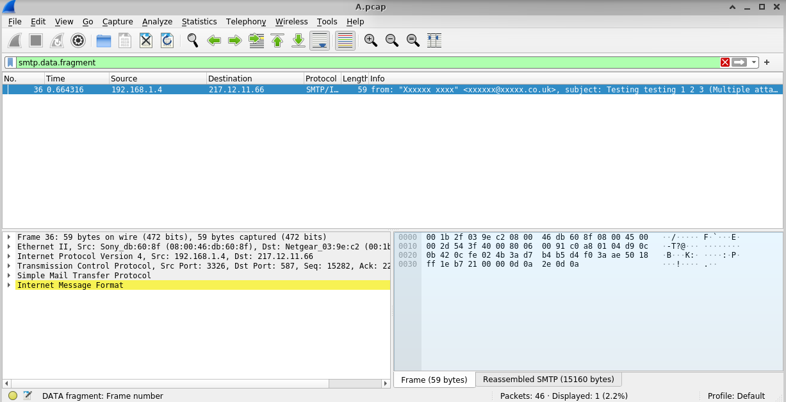
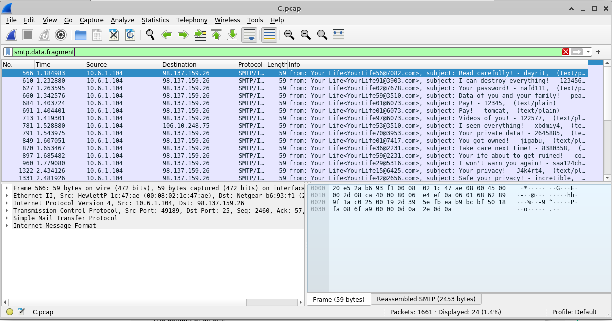
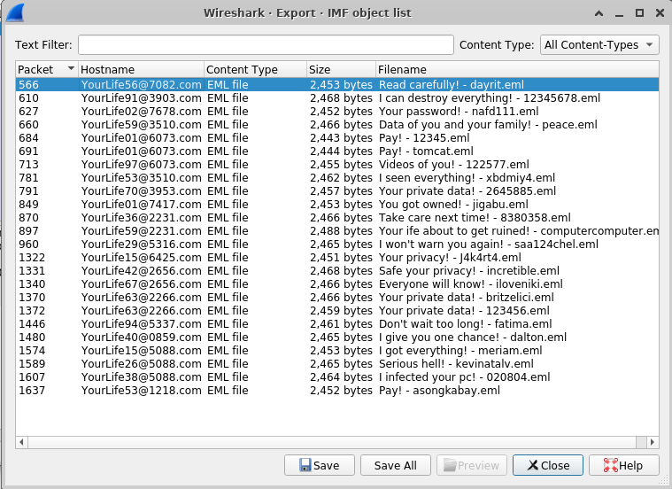

# CYB102 Project 1 — Business Email Compromise Investigation

## Overview

A forensic investigation of a Business Email Compromise (BEC) phishing campaign using Wireshark packet analysis. Given four network packet capture files recorded on different days, I identified the file containing malicious phishing emails, traced them to the attacker's IP address, and extracted the phishing content.

## Scenario

A malicious actor sent phishing emails to company employees, attempting to trick them into sending money. The goal was to inspect `.pcap` files, determine which emails were legitimate vs. fraudulent, and identify the attacker.

## Tools Used

- **Wireshark** — Network protocol analyzer for inspecting packet captures
- **SMTP display filters** — Used to isolate email traffic and extract message content
- **Azure Labs Ubuntu VM** — Secure environment for handling captures containing real malware samples

## Process

1. Downloaded and extracted `pcap_files.zip` containing four capture files: A.pcap, B.pcap, C.pcap, and D.pcap.

2. Opened each file in Wireshark and applied the display filter `smtp.data.fragment` to isolate email body content carried in SMTP data fragments.

3. A.pcap, B.pcap, and D.pcap each contained a single benign test email — subjects like "Testing testing 1 2 3," "SMTP," and "Test message for capture."

4. **C.pcap** returned 24 results — all phishing emails originating from the same source IP address, all using the fake sender name "Your Life" with randomized email addresses (e.g., YourLife56@7082.com), and all containing threatening subject lines.

5. Identified the malicious actor's IP and documented three phishing email subject lines.

6. Exported phishing emails as `.eml` files using Wireshark's **File → Export Objects → IMF** for further analysis.

## Findings

- **Malicious file:** C.pcap
- **Attacker IP:** `10.6.1.104`
- **Phishing pattern:** Mass emails from a single IP using randomized sender addresses under the "Your Life" alias with threatening/extortion-style subject lines

## Key Takeaways

- BEC attacks are designed to look legitimate — the real evidence lives in the metadata (source IP, SMTP headers, routing path), not in obvious red flags in the email body.
- Packet captures reveal network activity that email clients hide from users. Reading raw SMTP traffic is a foundational forensic skill.
- The IP-to-email attribution chain built here is how real SOC analysts trace phishing campaigns back to their infrastructure, even when attackers spoof display names and sender domains.

## Course

CYB102 — Intermediate Cybersecurity (CodePath) @ California State University, San Bernardino — Fall 2026
